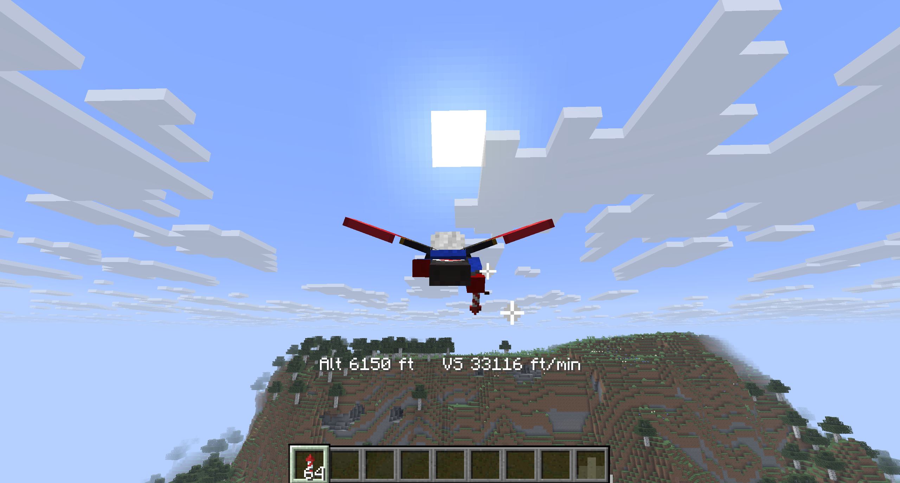
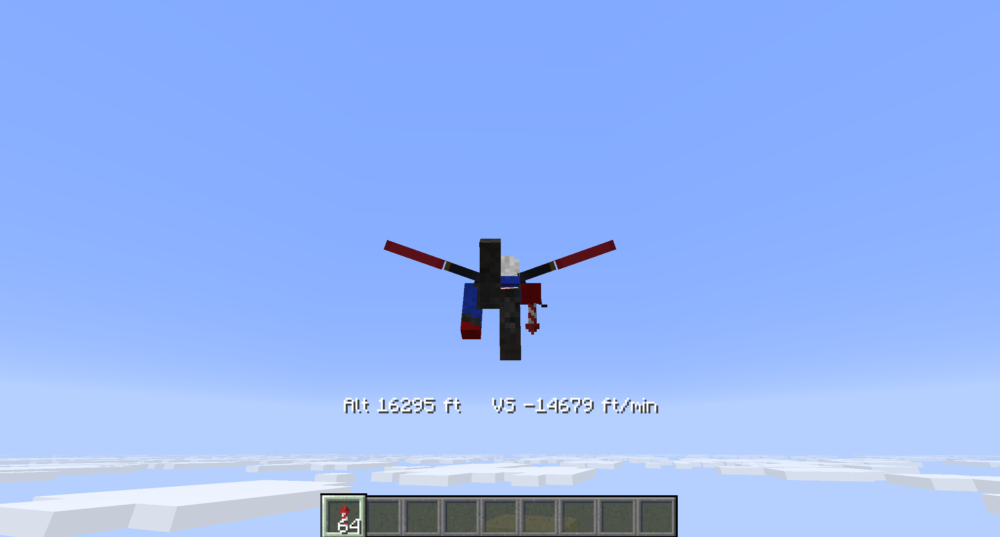
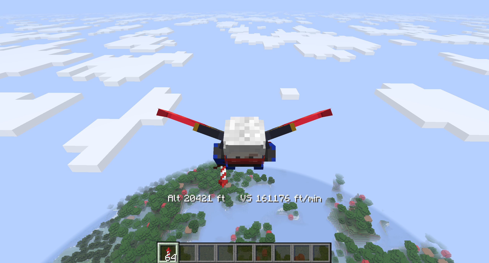

# Better Aerodymanics

**English** | [简体中文](./README.zh-CN.md)

## Version

This is a mod for Minecraft 26.1.2 with fabric 0.19.3. 

## What it does

This mod provides a basic aerodynamic implementation in Minecraft for elytra. In this mod, it is assumed that elytra has an airfoil of NACA 2412 (though any NACA four digit airfoil is supported). By reading the player's speed in real-time, the mod is able to calculate the boundary layer on the elytra and thus use panel method and 3D wing correction to solve for lift and drag. The goal is to provide a more realistic flying experience.

Together with aerodynamics is the impelemtation of International Standard Atmosphere (ISA) conditions. By default the mod uses the conventional conversion — the same scale as the speed conversion: 1 block = 1 m (3.28 ft), with 0 ft at the world's in-game sea level. The conversion is configurable in the mod's settings screen (press **O** in game, rebindable in Controls): besides the conventional mode there is an "Everest mapping" mode with two boxes to manually set the sea-level Y and the Mount Everest Y. The conversion then scales linearly between them so that the Everest Y reads 8,848 m (29,031 ft) — e.g. leaving the sea-level box at the in-game sea level and setting the Everest Y to 320 maps the build limit to the height of Mt. Everest. The same screen also toggles the HUD overlay (shared with the /aerohud command, persisted across launches). This mod also provides a simple HUD showing the current height of the player with the player's vertical speed, in "aviation unit", which is feet and feet per minute. 

## WHY

This is what happens when an aero student felt crazy.

## Version Download

[Downloads can be found here](build/libs) Please always use the latest version.
